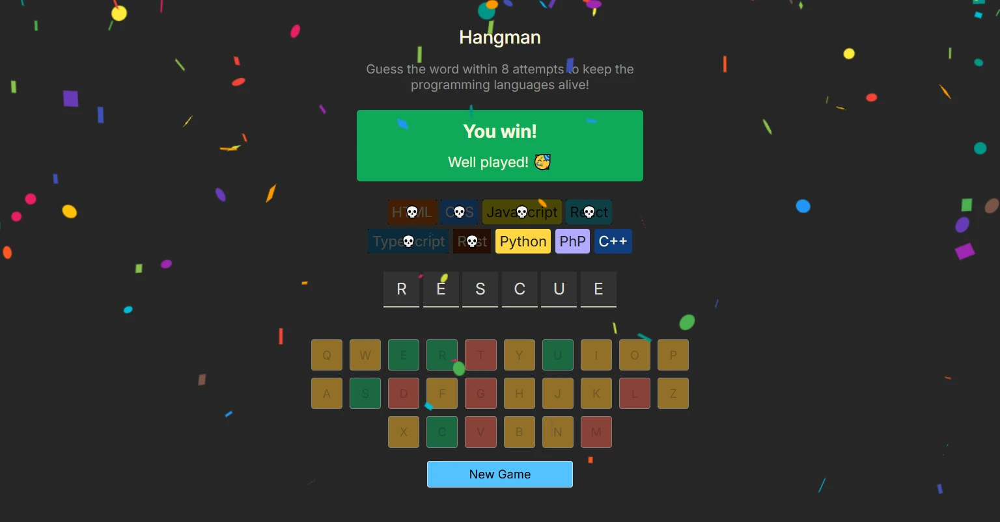

# Hangman minigame



---

↗️ **Demo:** [hangman](https://t-federer.github.io/react_04_hangman/) 

---

## 🔍 Overview & Purpose

This project is a small React take on the classic hangman game, built as an exercise in state management, conditional rendering, and basic accessibility. It offers a simple word‑guessing experience with clear visual feedback and a playful “lives” system based on programming languages.

Players guess letters to reveal the hidden word, losing one language for each mistake. The game ends when the word is solved or all languages are gone, with confetti on victory and a light, humorous message on defeat.

The minigame includes:
- State‑driven logic: React state tracks the current word, guessed letters, and game outcome;
- Conditional tendering: dynamic UI for win/lose states, revealed letters, and language “chips” as lives;
- Visual feedback: styling for correct and incorrect guesses, plus a confetti effect when the player wins;
- Accessible status updates: aria-live regions announce guess results and remaining attempts for assistive technologies;
- Replayability: a “New Game” button that resets the state and selects a new random word.

All code in this repository is written from scratch as a compact, self‑contained piece of frontend work showcased in my portfolio.

---

## 🛠️ Tech Stack

- [React](https://react.dev/), a component‑based JavaScript library for building dynamic, modular user interfaces; 
- [Vite](https://vitejs.dev/), a fast, modern build tool that provides instant dev‑server startup, smooth HMR, and optimized production builds.

---


## 📁 Project Structure
<!-- TREE_START -->
```
├─ package.json
└─ src
   ├─ App.jsx
   ├─ index.css
   ├─ index.jsx
   ├─ languages.js
   ├─ utils.js
   └─ words.js
```
<!-- TREE_END -->

---

## 📦 Installation

Ensure you have the following installed on your machine:
- [Git](https://git-scm.com/);
- [Node.js](https://nodejs.org/en);
- [npm](https://www.npmjs.com/) (Node Package Manager).

Then clone the repository: 
```bash
git clone https://github.com/t-Federer/react_04_hangman.git
```
And install the project dependencies:
```bash
cd react_04_hangman
npm install
npm run dev
```
Finally, open http://localhost:5173 in your browser to view the project.

---

## ⚖️ License

This project is released under the **MIT License**.  
You are free to study, modify, and reuse the code.
